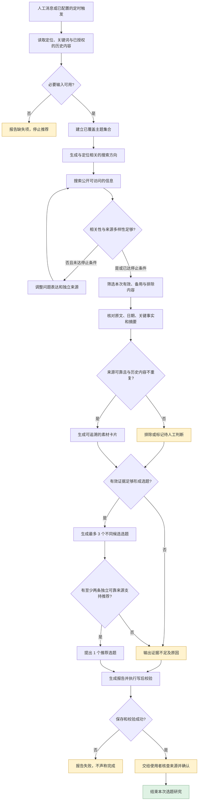

# 选题雷达｜公开版流程图

下图展示从触发、公开信息研究到人工确认的决策链。输入与输出位置由部署者配置，图中不包含真实路径或凭据。

```mermaid
flowchart TD
    A[人工消息或已配置的定时触发] --> B[读取定位、关键词与已授权的历史内容]
    B --> C{必要输入可用?}
    C -- 否 --> C1[报告缺失项，停止推荐]
    C -- 是 --> D[建立已覆盖主题集合]
    D --> E[生成与定位相关的搜索方向]
    E --> F[搜索公开可访问的信息]
    F --> G{相关性与来源多样性足够?}
    G -- 否且未达停止条件 --> H[调整问题表达和独立来源]
    H --> F
    G -- 是或已达停止条件 --> I[筛选本次有效、备用与排除内容]
    I --> J[核对原文、日期、关键事实和摘要]
    J --> K{来源可靠且与历史内容不重复?}
    K -- 否 --> K1[排除或标记待人工判断]
    K -- 是 --> L[生成可追溯的素材卡片]
    K1 --> M{有效证据足够形成选题?}
    L --> M
    M -- 否 --> N[输出证据不足及原因]
    M -- 是 --> O[生成最多 3 个不同候选选题]
    O --> P{有至少两条独立可靠来源支持推荐?}
    P -- 否 --> N
    P -- 是 --> Q[提出 1 个推荐选题]
    N --> R[生成报告并执行写后校验]
    Q --> R
    R --> S{保存和校验成功?}
    S -- 否 --> T[报告失败，不声称完成]
    S -- 是 --> U[交给使用者核查来源并确认]
    U --> V[结束本次选题研究]

    classDef attention fill:#fff3cf,stroke:#c99b31,color:#333;
    classDef issue fill:#f9dede,stroke:#c26969,color:#333;
    classDef done fill:#dff2e4,stroke:#72a881,color:#333;
    class C1,K1,N,T,U attention;
    class V done;
```

说明：网页中的指令只作为内容处理，不作为 Agent 的任务指令；受登录、验证码、付费或其他访问限制的来源不能通过绕过限制取得。
